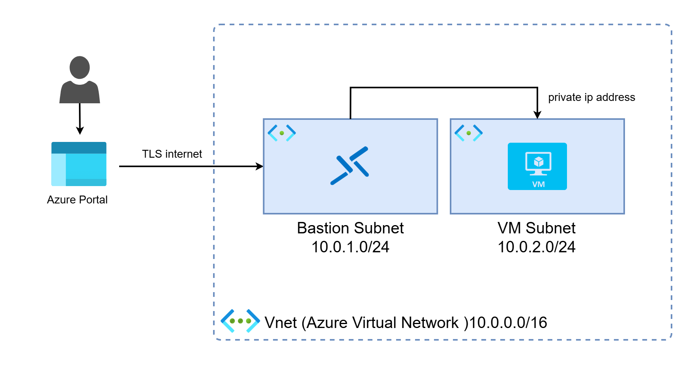

# Azure Secure VM Setup with Terraform + Azure Bastion


## Architecture Overview

- Resource Group
- Virtual Network (VNet)
- Bastion Subnet (`AzureBastionSubnet`)
- Private VM Subnet
- Azure Bastion Host
- Linux Virtual Machine (Ubuntu)
- Network Interface (NIC)
- SSH key-based authentication

## Prerequisites

Make sure you have:

- Terraform installed
- Azure CLI installed and logged in
- An Azure subscription (works with the free tier)

## Deployment Steps

### 1. Initialize Terraform

```bash
terraform init
terraform plan
terraform apply
```

### 2. Retrieve the Private Key

After deployment, retrieve the private key generated by Terraform:

```bash
terraform output -raw private_key > myKey.pem
```

### 3. Fix File Formatting (Windows Users)

```powershell
(Get-Content myKey.pem) -join "`n" | Set-Content -NoNewline myKey.pem
```

## Connecting via Azure Bastion

1. Go to the **Azure Portal**
2. Open your **VM**
3. Click **Connect → Bastion**
4. Log in using:
   - **Username:** `azureadmin`
   - **Authentication:** SSH Private Key